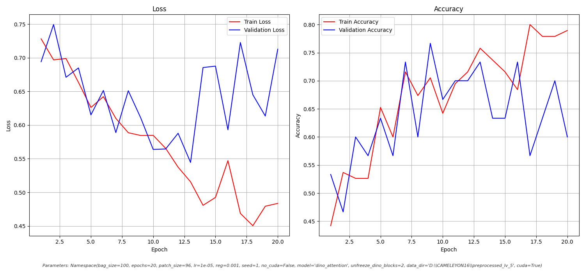
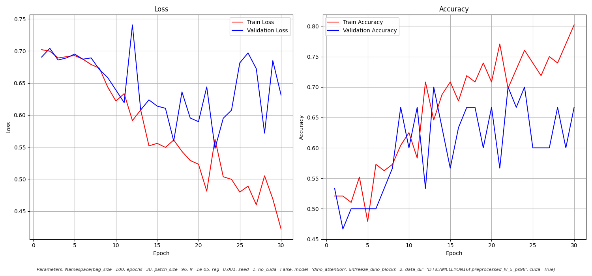
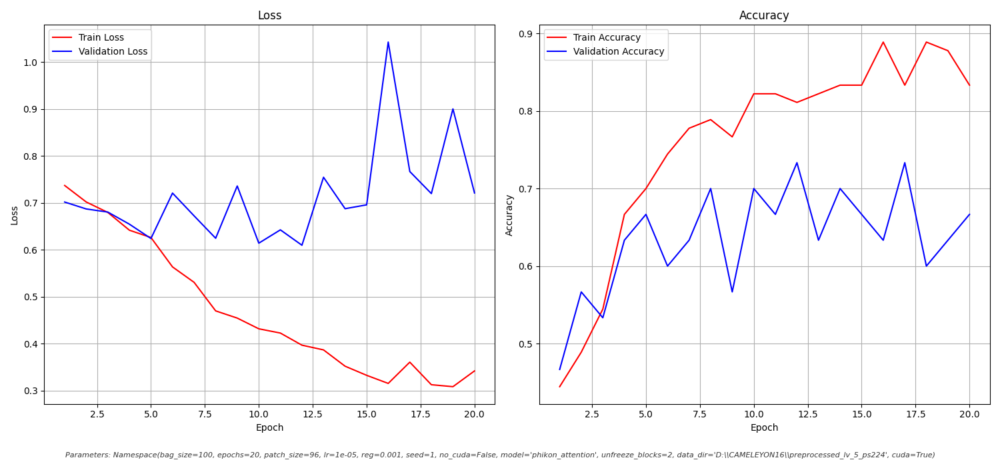
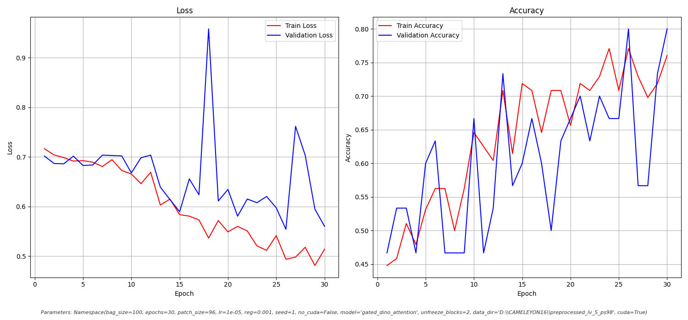

# Opis przeprowadzonych eksperymentów

## Dataset
Poniższe eskperymenty przeprowadzona subsecie datasetu CAMELYON16.
Zbiór treningowy zawierał 96 zdjęć, po 48 chorych i zdrowych. Zbiór testowy składa się z 30 zdjęć. W przyszłości planujemy testy najlepszych modeli na całości datasetu.

## Preprocessing
Zdjęcia histopatologiczne cięte są wg siatki na patche, które następnie pakowane są do bagów, zgodnie z założeniami MIL. W większości eksperymentów wykorzystywane jest 32 krotne powiększenie a patche są kwadratami o boku 98px. Zdjęcia w datasecie
są skanami badań histopatologicznych, więc interesująca nas tkanka stanowi część obrazu. Odrzucane są patche z białym tłem oraz niezawierające koloru różowego (sprawdzenie po różnicy jasności między kanałami).

## Feature extractor
Jeśli nie wspomniano inaczej wykorzysywane jest DINOv2 z odblokowanymi 2 ostatnimi warstwami. Dane jak lr znajdują się na wykresach.

## Trening

### Attention
Wykorzystano model Attention z implementacji artykułu Attention Based MIL po zmianie feature extractora.

#### DINO ViT base

#### DINO ViT s_reg

#### Phikon
Jest to DINO po fine tuningu w dziedzinie histopatologii. Przyjmuje kwadratowe obrazy o sztywnym boku 224, dlatego dostosowano preprocessing. Zachowano 32 krotne powiększenie co znacznie redukuję ilość patchy w bagu. Na mniejsze powiększenie nie pozwala pamięć mojego komputera.

### GatedAttention
Modyfikacje 2giego z modeli.

#### DINO ViT base

### Zmiana wielkości warstwy ukrytej
Po przeprowadzeniu wcześniejszych eksperymentów zostało zauważone że DINO zwraca 768 cech które są rzutowane do warstwy ukrytej wielkości 500. Warstwa ta została dopasowana do rozmiaru zwracanego przez DINO.

#### s_reg

#### s_reg o zmniejszonym lr
